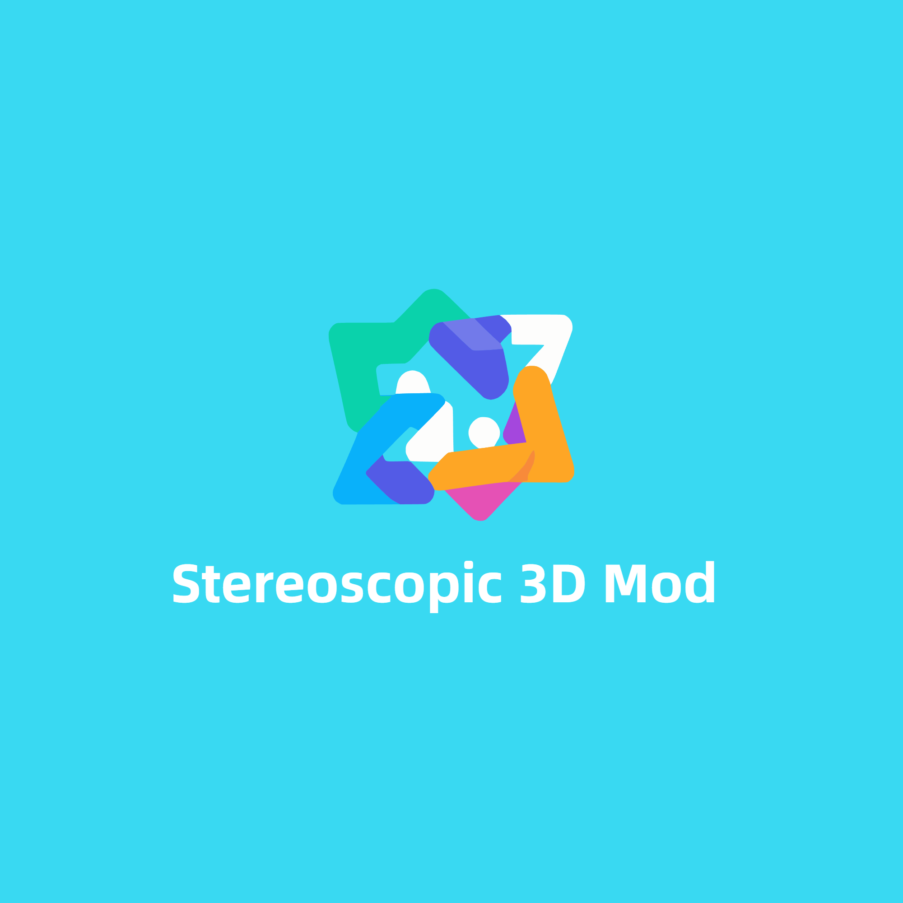

# 2D-to-3D-Mod-for-PC-Games

	  

# Introduction

A mod made by stereoscopic 3D enthusiasts that tranfer your 2D games into 3D experience.

This mod requires specific devices to work. Please confirm whether your device meets the requirements before installation.

# Supported Games

| **Games** | **Platform** | **Mod file placement path** |
| --- | --- | --- |
| ACE COMBAT 7 | Steam | ACE COMBAT 7/ |
| Assassins Creed Odyssey | Steam | Assassins Creed Odyssey/ |
| Assassin's Creed Valhalla | Steam | Assassin's Creed Valhalla/ |
| Baldurs Gate 3 | Steam | Baldurs Gate 3/bin/ |
| Battlefield V | Steam | Battlefield V/ |
| BloodySpell | Steam | BloodySpell/ |
| Counter-Strike Global Offensive | Steam | Counter-Strike Global Offensive/game/bin/win64/ |
| Cyberpunk 2077 | Steam | Cyberpunk 2077/bin/x64/ |
| DEATH STRANDING DIRECTORS CUT | Steam | DEATH STRANDING DIRECTORS CUT/ |
| Devil May Cry 5 | Steam | Devil May Cry 5/ |
| Diablo IV | Steam | Diablo IV/ |
| Dying Light 2 | Steam | Dying Light 2/ph/work/bin/x64/ |
| Dynasty Warriors 9 | Steam | Dynasty Warriors 9/ |
| ForzaHorizon5 | Steam | ForzaHorizon5/ |
| Godofwar | Steam | GodOfWar/ |
| Granblue Fantasy Relink | Steam | Granblue Fantasy Relink/ |
| Grand Theft Auto V | Steam | Grand Theft Auto V/ |
| GRID (2019) | Steam | GRID (2019)/ |
| Hogwarts Legacy | Steam | Hogwarts Legacy/Phoenix/Binaries/Win64/ |
| Hollow Cocoon | Steam | Hollow Cocoon/ |
| Immortals Fenyx Rising | Steam | Immortals Fenyx Rising/ |
| Jedi Fallen Order | Steam | Jedi Fallen Order/SwGame/Binaries/Win64/ |
| Last Epoch | Steam | Last Epoch/ |
| Monster Hunter World | Steam | Monster Hunter World/ |
| NBA 2K23 | Steam | NBA 2K23/ |
| Palworld | Steam | Pal/Binaries/Win64 |
| Persona 5 Tactica | Steam | Persona 5 Tactica/ |
| PUBG | Steam | PUBG/ |
| Red Dead Redemption 2 | Steam | Red Dead Redemption 2/ |
| Remnant | Steam | Remnant/ |
| RESIDENT EVIL 4 BIOHAZARD RE4 | Steam | RESIDENT EVIL 4 BIOHAZARD RE4/ |
| RESIDENT EVIL 4 BIOHAZARD RE4 Chainsaw Demo | Steam | RESIDENT EVIL 4 BIOHAZARD RE4 Chainsaw Demo/ |
| Sekiro | Steam | Sekiro/ |
| Shadow of the Tomb Raider | Steam | Shadow of the Tomb Raider/ |
| Skyrim Special Edition | Steam | Skyrim Special Edition/ |
| Stardew Valley | Steam | Stardew Valley/ |
| StrangeBrigade | Steam | StrangeBrigade/bin/ |
| Subnautica | Steam | Subnautica/ |
| The Witcher 3 | Steam | The Witcher 3/bin/x64_dx12/ |
| Titanfall2 | Steam | Titanfall2/bin/x64_retail/ |
| Sword and Fairy 7 | Steam | 仙剑奇侠传七/Pal7/Binaries/Win64/ |
| BlackMythWukong | Steam | BlackMythWukong/b1/Binaries/Win64/ |
| FINAL FANTASY XV PLAYABLE DEMO | Steam | FINAL FANTASY XV PLAYABLE DEMO/ |
| No Man's Sky | Steam | No Man's Sky/Binaries/ |
| Party Animals | Steam | Party Animals/ |
| Asphalt 9 Legends | Steam | Asphalt 9 Legends/ |
| Uncharted Legacy of Thieves Collection | Steam | Uncharted Legacy of Thieves Collection/ |
| The Last of Us Part I | Steam | The Last of Us Part I/ |
| Sniper Elite 4 | Steam | Sniper Elite 4/bin/ |
| Under The Waves | Steam | Under The Waves/ |
| PAYDAY3 | Steam | PAYDAY3/PAYDAY3/Binaries/Win64/ |
| Ratchet & Clank - Rift Apart | Steam | Ratchet & Clank - Rift Apart/ |
| Need for Speed Heat | Steam | Need for Speed Heat/ |
| Fallout 4 | Steam | Fallout 4/ |
| Need for Speed(TM) Rivals | Steam | Need for Speed(TM) Rivals/ |
| Marvel's Spider-Man Remastered | Steam | Marvel's Spider-Man Remastered/ |
| MicrosoftFlightSimulator | Steam | MicrosoftFlightSimulator/ |
| BlackMyth:Wukong | Steam | BlackMythWukong/b1/Binaries/Win64/ |

# How to Install 2D to 3D Mod？

Step 1: Purchase and download the game on Steam

Step 2: Download the Mod file on this Github page

Step 3: Copy the Mod file to the target directory according to the game target path information in the table above.

Step 4: Enjoy

# How to Uninstall?

Delete the Mod file in the game directory to restore 2D mode.

# Currently supported devices

- **Sunday Dragon 3D One Handheld (Intel Core Ultra 7 258V)**
- More devices coming soon......
